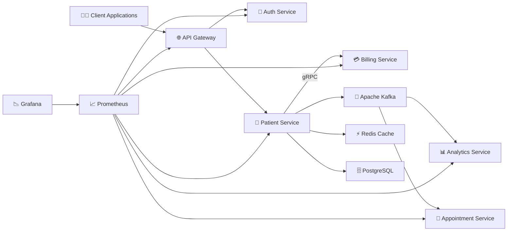

# 🏥 Patient Management System

> A **production-style Java Spring Boot Microservices** application demonstrating modern backend engineering practices including **REST APIs, gRPC, Apache Kafka, JWT Authentication, Spring Cloud Gateway, Redis Caching, Resilience4j Circuit Breakers, Prometheus, Grafana, Docker**, and **Integration Testing**.

<p align="center">


</p>

---

# 📖 Overview

Patient Management System is a **distributed microservices application** built with **Java 21** and **Spring Boot** to demonstrate real-world backend architecture.

Unlike a traditional monolithic application, the system is divided into multiple independent services that communicate using the most appropriate communication pattern:

- 🌐 REST APIs for client communication
- ⚡ gRPC for fast synchronous service-to-service communication
- 📨 Apache Kafka for asynchronous event-driven communication

The project also incorporates production-grade backend concepts including:

- 🔐 JWT Authentication & Authorization
- 🌐 Spring Cloud Gateway
- 💾 Redis Caching
- ⚡ Circuit Breakers (Resilience4j)
- 📊 Prometheus Monitoring
- 📈 Grafana Dashboards
- 🐳 Docker Containerization
- 🧪 Integration Testing

---

# ✨ Features

### 👨‍⚕️ Patient Management

- Create Patient
- Update Patient
- Delete Patient
- Get Patient Details
- Validation & Exception Handling

### 🔐 Authentication

- JWT Login
- Token Validation
- Protected APIs
- Spring Security

### 🌐 API Gateway

- Centralized Routing
- JWT Validation
- Rate Limiting
- Single Entry Point

### 💳 Billing

- gRPC Communication
- Billing Account Creation

### 📨 Event Driven Architecture

- Apache Kafka
- Patient Created Events
- Analytics Processing
- Appointment Synchronization

### ⚡ Performance

- Redis Caching
- Spring Data JPA
- PostgreSQL

### 📊 Monitoring

- Prometheus
- Grafana
- Spring Boot Actuator
- Micrometer

### 🛡 Fault Tolerance

- Resilience4j Circuit Breakers

---

# 🛠 Tech Stack

| Category | Technologies |
|-----------|-------------|
| **Language** | Java 21 |
| **Framework** | Spring Boot 3 |
| **Security** | Spring Security, JWT |
| **Gateway** | Spring Cloud Gateway |
| **Communication** | REST, gRPC |
| **Messaging** | Apache Kafka |
| **Serialization** | Protocol Buffers |
| **Database** | PostgreSQL |
| **Cache** | Redis |
| **ORM** | Spring Data JPA |
| **Monitoring** | Prometheus, Grafana |
| **Observability** | Spring Boot Actuator, Micrometer |
| **Fault Tolerance** | Resilience4j |
| **Testing** | JUnit, Rest Assured |
| **Build Tool** | Maven |
| **Containerization** | Docker |

---

# 🏗️ Technical Architecture



---

# 🎯 System Architecture

The application follows a **Microservices Architecture**, where each service owns its business logic and database while communicating through synchronous and asynchronous channels.

| Service | Responsibility |
|----------|---------------|
| 🌐 API Gateway | Routing, Authentication, Rate Limiting |
| 🔐 Auth Service | JWT Authentication & Validation |
| 🏥 Patient Service | Patient CRUD Operations |
| 💳 Billing Service | Billing Account Creation (gRPC) |
| 📊 Analytics Service | Kafka Consumer for Analytics |
| 📅 Appointment Service | Appointment Management |

---

# 🚀 Communication Pattern

| Communication | Technology | Purpose |
|---------------|------------|----------|
| Client → Gateway | REST | External APIs |
| Gateway → Auth | REST | JWT Validation |
| Gateway → Patient | REST | CRUD Operations |
| Patient → Billing | gRPC | Billing Account Creation |
| Patient → Kafka | Kafka | Publish Patient Events |
| Kafka → Analytics | Kafka Consumer | Analytics Processing |
| Kafka → Appointment | Kafka Consumer | Patient Synchronization |

---

# 📂 Project Modules

```text
patient-management/

├── api-gateway
├── auth-service
├── patient-service
├── billing-service
├── analytics-service
├── appointment-service
├── grpc-proto
├── docker-compose.yml
└── README.md
```

---
