# 🏥 Patient Management System

> A **production-style Java Spring Boot Microservices** application demonstrating modern backend engineering practices including **REST APIs, gRPC, Apache Kafka, JWT Authentication, Spring Cloud Gateway, Redis Caching, Resilience4j Circuit Breakers, Prometheus, Grafana, Docker**, and **Integration Testing**.

<p align="center">


</p>

---

# 📖 Overview

Patient Management System is a **distributed microservices application** built with **Java 21** and **Spring Boot** to demonstrate real-world backend architecture.

Unlike a traditional monolithic application, the system is divided into multiple independent services that communicate using the most appropriate communication pattern:

- 🌐 REST APIs for client communication
- ⚡ gRPC for fast synchronous service-to-service communication
- 📨 Apache Kafka for asynchronous event-driven communication

The project also incorporates production-grade backend concepts including:

- 🔐 JWT Authentication & Authorization
- 🌐 Spring Cloud Gateway
- 💾 Redis Caching
- ⚡ Circuit Breakers (Resilience4j)
- 📊 Prometheus Monitoring
- 📈 Grafana Dashboards
- 🐳 Docker Containerization
- 🧪 Integration Testing

---

# ✨ Features

### 👨‍⚕️ Patient Management

- Create Patient
- Update Patient
- Delete Patient
- Get Patient Details
- Validation & Exception Handling

### 🔐 Authentication

- JWT Login
- Token Validation
- Protected APIs
- Spring Security

### 🌐 API Gateway

- Centralized Routing
- JWT Validation
- Rate Limiting
- Single Entry Point

### 💳 Billing

- gRPC Communication
- Billing Account Creation

### 📨 Event Driven Architecture

- Apache Kafka
- Patient Created Events
- Analytics Processing
- Appointment Synchronization

### ⚡ Performance

- Redis Caching
- Spring Data JPA
- PostgreSQL

### 📊 Monitoring

- Prometheus
- Grafana
- Spring Boot Actuator
- Micrometer

### 🛡 Fault Tolerance

- Resilience4j Circuit Breakers

---

# 🛠 Tech Stack

| Category | Technologies |
|-----------|-------------|
| **Language** | Java 21 |
| **Framework** | Spring Boot 3 |
| **Security** | Spring Security, JWT |
| **Gateway** | Spring Cloud Gateway |
| **Communication** | REST, gRPC |
| **Messaging** | Apache Kafka |
| **Serialization** | Protocol Buffers |
| **Database** | PostgreSQL |
| **Cache** | Redis |
| **ORM** | Spring Data JPA |
| **Monitoring** | Prometheus, Grafana |
| **Observability** | Spring Boot Actuator, Micrometer |
| **Fault Tolerance** | Resilience4j |
| **Testing** | JUnit, Rest Assured |
| **Build Tool** | Maven |
| **Containerization** | Docker |

---

# 🏗️ Technical Architecture

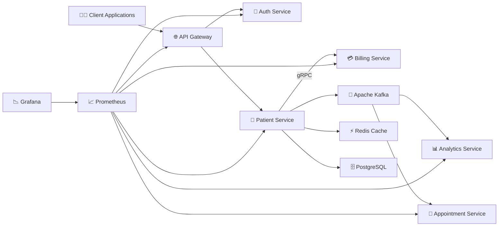

---

# 🎯 System Architecture

The application follows a **Microservices Architecture**, where each service owns its business logic and database while communicating through synchronous and asynchronous channels.

| Service | Responsibility |
|----------|---------------|
| 🌐 API Gateway | Routing, Authentication, Rate Limiting |
| 🔐 Auth Service | JWT Authentication & Validation |
| 🏥 Patient Service | Patient CRUD Operations |
| 💳 Billing Service | Billing Account Creation (gRPC) |
| 📊 Analytics Service | Kafka Consumer for Analytics |
| 📅 Appointment Service | Appointment Management |

---

# 🚀 Communication Pattern

| Communication | Technology | Purpose |
|---------------|------------|----------|
| Client → Gateway | REST | External APIs |
| Gateway → Auth | REST | JWT Validation |
| Gateway → Patient | REST | CRUD Operations |
| Patient → Billing | gRPC | Billing Account Creation |
| Patient → Kafka | Kafka | Publish Patient Events |
| Kafka → Analytics | Kafka Consumer | Analytics Processing |
| Kafka → Appointment | Kafka Consumer | Patient Synchronization |

---

# 📂 Project Modules

```text
patient-management/

├── api-gateway
├── auth-service
├── patient-service
├── billing-service
├── analytics-service
├── appointment-service
├── grpc-proto
├── docker-compose.yml
└── README.md
```
# 🧩 Microservices Overview

The application follows the **Database per Service** pattern, where each microservice owns its own business logic and persistence layer. This enables independent development, deployment, and scaling while reducing coupling between services.

---

## 🌐 API Gateway

The API Gateway acts as the **single entry point** for all client requests.

### Responsibilities

- Routes incoming requests to appropriate microservices
- Validates JWT tokens through the Auth Service
- Applies Rate Limiting
- Hides internal microservice URLs from clients
- Provides centralized request handling

### Why API Gateway?

Without an API Gateway:

```text
Client
 ├── Patient Service
 ├── Billing Service
 ├── Auth Service
 ├── Appointment Service
 └── Analytics Service
```

The client must know every service URL.

With an API Gateway:

```text
Client
      │
      ▼
API Gateway
      │
 ┌────┴────┐
 ▼         ▼
Auth    Patient
```

The client communicates with only one endpoint while the Gateway handles routing internally.

---

## 🔐 Auth Service

The Auth Service is responsible for authentication and authorization.

### Responsibilities

- User Login
- Password Verification
- JWT Generation
- JWT Validation
- User Management

### Database

- PostgreSQL

### Main Components

```text
Controller
     │
     ▼
Service
     │
     ▼
Repository
     │
     ▼
PostgreSQL
```

### Authentication Flow

```text
User Login

↓

Verify Credentials

↓

Generate JWT

↓

Return Token
```

The Gateway later validates every protected request using this service.

---

## 🏥 Patient Service

The Patient Service is the **core business service** of the application.

It manages patient records and coordinates communication with other services.

### Responsibilities

- Create Patient
- Read Patient
- Update Patient
- Delete Patient
- Validate Input
- Publish Kafka Events
- Call Billing Service via gRPC
- Redis Caching

### Architecture

```text
Controller
     │
     ▼
Service
     │
     ▼
Repository
     │
     ▼
PostgreSQL
```

### Internal Workflow

1. Validate Request DTO
2. Check if Email Already Exists
3. Save Patient
4. Call Billing Service (gRPC)
5. Publish Kafka Event
6. Return Response

---

## 💳 Billing Service

The Billing Service is responsible for managing billing accounts.

Instead of exposing REST APIs, it exposes a **gRPC API** for high-performance internal communication.

### Responsibilities

- Create Billing Account
- Respond to gRPC Requests

### Communication

```text
Patient Service

↓

gRPC

↓

Billing Service

↓

Billing Account Created
```

Using gRPC instead of REST reduces serialization overhead and improves performance for internal service communication.

---

## 📊 Analytics Service

The Analytics Service consumes events published to Kafka.

It is completely independent of the Patient Service.

### Responsibilities

- Consume Patient Events
- Process Analytics
- Logging
- Event Processing

### Event Flow

```text
Patient Created

↓

Kafka Topic

↓

Analytics Service

↓

Process Event
```

The Patient Service does not know whether Analytics exists, making the architecture loosely coupled.

---

## 📅 Appointment Service

The Appointment Service manages appointment-related operations.

It also listens to Kafka events to keep patient information synchronized locally.

### Responsibilities

- Appointment Scheduling
- Kafka Consumer
- Patient Cache Synchronization

### Why Consume Kafka Events?

Instead of calling the Patient Service every time appointment data is required, the Appointment Service maintains its own lightweight copy of patient information.

Benefits:

- Reduced Network Calls
- Faster Reads
- Independent Availability
- Better Scalability

---

# 🗄 Database Per Service Pattern

Each microservice owns its own database.

```text
Patient Service
       │
       ▼
Patient Database

Billing Service
       │
       ▼
Billing Database

Auth Service
       │
       ▼
User Database
```

### Why?

Sharing databases tightly couples services.

If Billing directly accesses the Patient database:

- Schema changes become risky
- Independent deployment becomes difficult
- Services become dependent on each other

Owning individual databases keeps each service autonomous.

---

# 🔄 Communication Between Services

The application uses different communication mechanisms depending on the use case.

| Communication | Technology | Why? |
|---------------|------------|------|
| Client → Gateway | REST | Public APIs |
| Gateway → Auth | REST | Token Validation |
| Gateway → Patient | REST | CRUD Operations |
| Patient → Billing | gRPC | Fast synchronous communication |
| Patient → Kafka | Kafka | Event Publishing |
| Kafka → Analytics | Kafka Consumer | Analytics Processing |
| Kafka → Appointment | Kafka Consumer | Patient Synchronization |

---

# 🧠 Why Multiple Communication Patterns?

The project intentionally combines **REST**, **gRPC**, and **Kafka**, as each solves a different problem.

### REST

Used for communication with external clients.

**Advantages**

- Human-readable
- Easy to debug
- Widely supported

---

### gRPC

Used for synchronous communication between internal services.

**Advantages**

- Binary serialization (Protocol Buffers)
- Smaller payloads
- Faster than REST
- Strongly typed
- Automatic client/server code generation

---

### Kafka

Used for asynchronous event-driven communication.

**Advantages**

- Loose coupling
- High throughput
- Event replay
- Independent consumers
- Horizontal scalability

Instead of directly notifying every service, the Patient Service publishes a single event, allowing multiple services to react independently.

---

# 📌 Why Microservices?

Compared to a monolithic architecture, this design provides:

- Independent deployment
- Independent scaling
- Better fault isolation
- Technology flexibility
- Clear ownership of business domains
- Easier maintenance
- Improved scalability

Each microservice focuses on a single business capability while collaborating with others through well-defined interfaces.

---
# 🔄 Request & Communication Flows

This section illustrates how the different microservices collaborate to process requests using **REST**, **gRPC**, and **Apache Kafka**.

---

# 🔐 Authentication Flow

Before accessing protected APIs, users authenticate with the **Auth Service** to obtain a JWT.

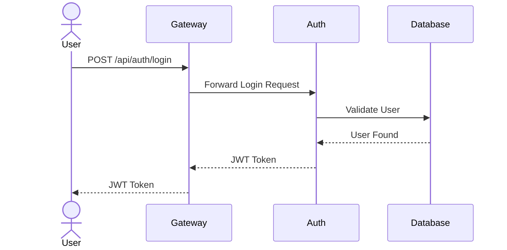

---

# 🛡 Protected Request Flow

Every secured request passes through the API Gateway.

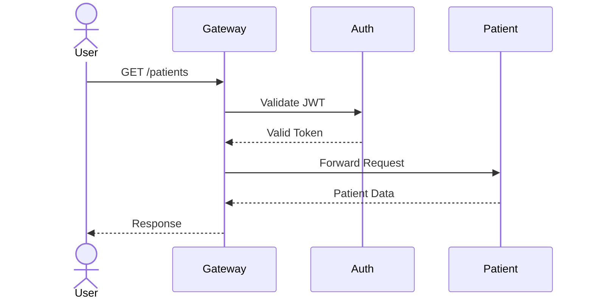

If the token is invalid, the Gateway immediately returns:

```text
401 Unauthorized
```

without forwarding the request.

---

# 🏥 Create Patient Flow

This is the primary business workflow of the application.

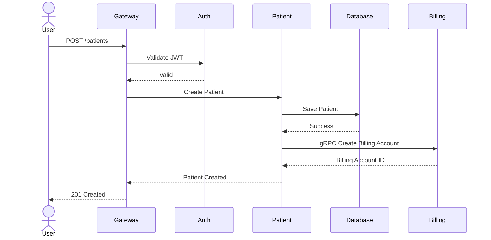

---

# ⚡ gRPC Communication

Internal service-to-service communication uses **gRPC**.

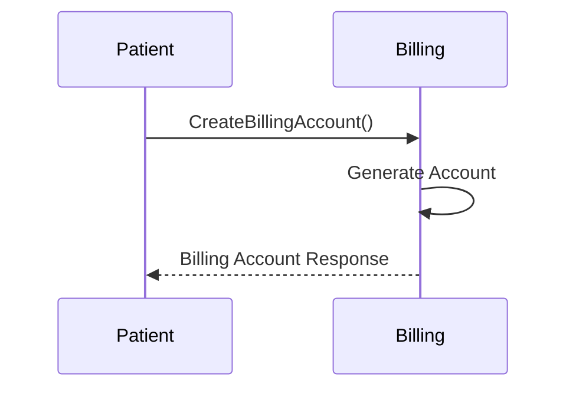

### Why gRPC?

- Faster than REST
- Binary Protocol Buffers
- Strongly Typed
- Automatic Code Generation
- Ideal for Internal Communication

---

# 📨 Kafka Event Flow

After successfully creating a patient, the Patient Service publishes an event.

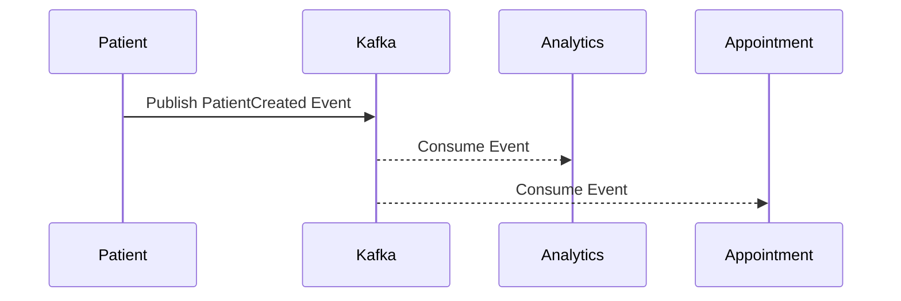

This architecture allows multiple services to react independently without modifying the Patient Service.

---

# 📊 Event Driven Architecture

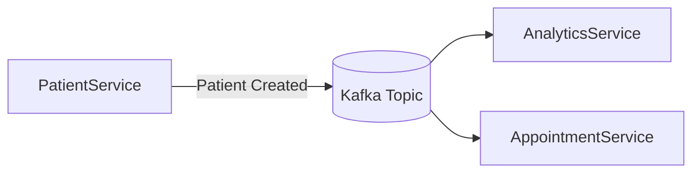

The Patient Service publishes an event only once, while any number of consumers can subscribe independently.

---

# ⚡ Redis Cache Flow

Frequently accessed patient information is cached to reduce database load.

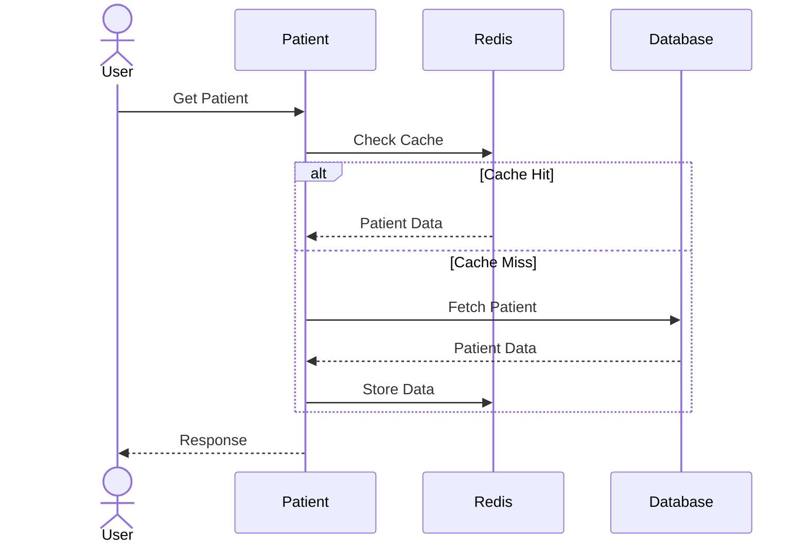

### Benefits

- Reduced database load
- Faster response times
- Lower latency
- Improved scalability

---

# 💳 Billing Communication Flow

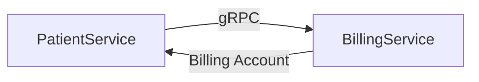

---

# 🌐 Complete System Flow

The following diagram summarizes the entire request lifecycle.

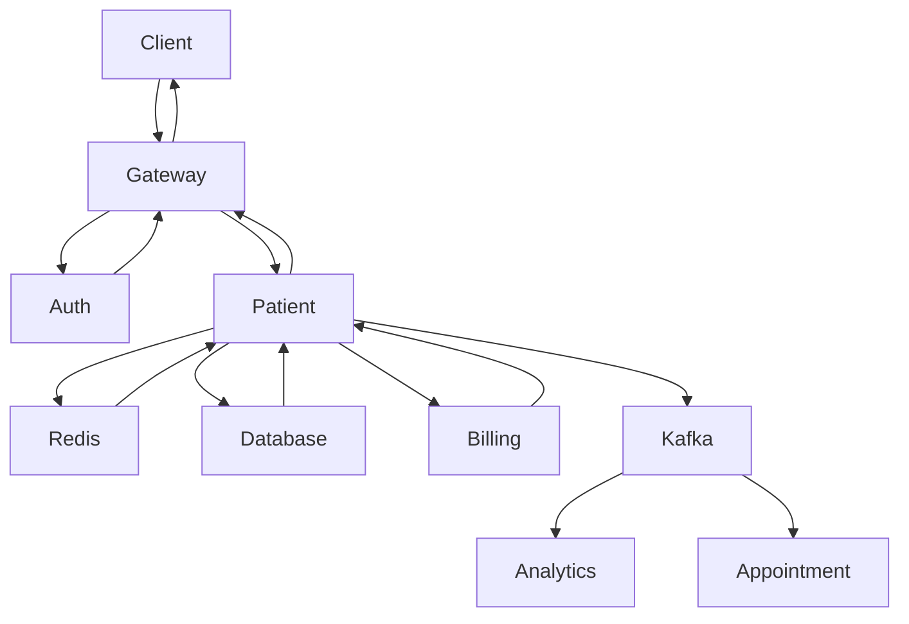

---

# 📡 Communication Summary

| Source | Destination | Protocol | Purpose |
|----------|-------------|-----------|-----------|
| Client | API Gateway | REST | External API Requests |
| Gateway | Auth Service | REST | JWT Validation |
| Gateway | Patient Service | REST | CRUD Operations |
| Patient Service | Billing Service | gRPC | Billing Account Creation |
| Patient Service | Kafka | Kafka Producer | Publish Patient Events |
| Kafka | Analytics Service | Kafka Consumer | Event Processing |
| Kafka | Appointment Service | Kafka Consumer | Patient Synchronization |
| Patient Service | Redis | Redis Protocol | Cache Operations |
| Patient Service | PostgreSQL | JDBC | Persistent Storage |

---

# 💡 Why This Architecture?

The system combines multiple communication styles because each serves a different purpose.

| Technology | Best Use Case |
|------------|--------------|
| REST | Client-facing APIs |
| gRPC | Fast synchronous service communication |
| Kafka | Asynchronous event streaming |
| Redis | High-speed caching |
| PostgreSQL | Persistent storage |

Choosing the appropriate communication mechanism for each interaction results in a scalable, maintainable, and loosely coupled architecture.

# ⚙️ Production-Ready Features

Beyond implementing business functionality, this project incorporates several production-grade backend engineering practices focused on **performance**, **fault tolerance**, **observability**, and **system reliability**.

---

# ⚡ Redis Caching

The Patient Service uses **Redis** as an in-memory cache to reduce database access for frequently requested patient information.

## Cache Workflow

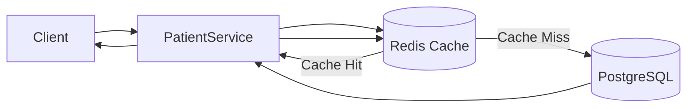

## Cache Strategy

1. Client requests patient details.
2. Patient Service first checks Redis.
3. If data exists (**Cache Hit**), it is returned immediately.
4. Otherwise (**Cache Miss**), data is fetched from PostgreSQL.
5. The result is stored in Redis for future requests.

### Benefits

- Reduced Database Load
- Lower Latency
- Faster Response Times
- Improved Scalability

---

# 🛡 Circuit Breaker (Resilience4j)

The Patient Service communicates synchronously with the Billing Service using gRPC.

If Billing becomes unavailable, repeated requests could overwhelm the Patient Service.

To prevent cascading failures, the project uses **Resilience4j Circuit Breakers**.

---

## Circuit Breaker States

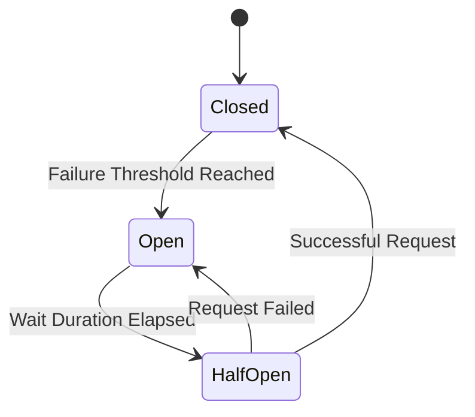

---

## Closed State

All requests are forwarded normally.

```text
Patient Service

↓

Billing Service

↓

Success
```

---

## Open State

After multiple consecutive failures:

```text
Patient Service

↓

Circuit Breaker

↓

Billing Service (Skipped)

↓

Immediate Failure Response
```

No requests reach the Billing Service.

---

## Half Open State

After the configured wait duration:

- A limited number of requests are allowed.
- If successful, the circuit closes.
- Otherwise, it reopens.

---

## Advantages

- Prevents Cascading Failures
- Faster Failure Detection
- Improved Availability
- Automatic Recovery

---

# 🚦 API Rate Limiting

The API Gateway implements **Rate Limiting** to protect backend services against excessive traffic.

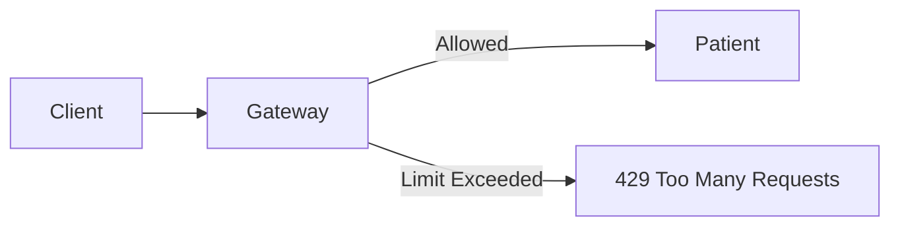

### Benefits

- Prevents API Abuse
- Protects Backend Services
- Improves Stability
- Supports Fair Resource Usage

---

# 📈 Spring Boot Actuator

Spring Boot Actuator exposes operational endpoints that provide runtime information about the application.

Available endpoints include:

```text
/actuator/health

/actuator/info

/actuator/metrics

/actuator/prometheus
```

These endpoints are used for monitoring and health checks.

---

# 📊 Micrometer

Micrometer serves as the metrics abstraction layer for Spring Boot.

It collects application metrics and exports them in a format compatible with Prometheus.

```text
Spring Boot

↓

Micrometer

↓

Prometheus
```

---

# 📈 Prometheus

Prometheus continuously collects metrics from each microservice by scraping the `/actuator/prometheus` endpoint.

## Monitoring Architecture

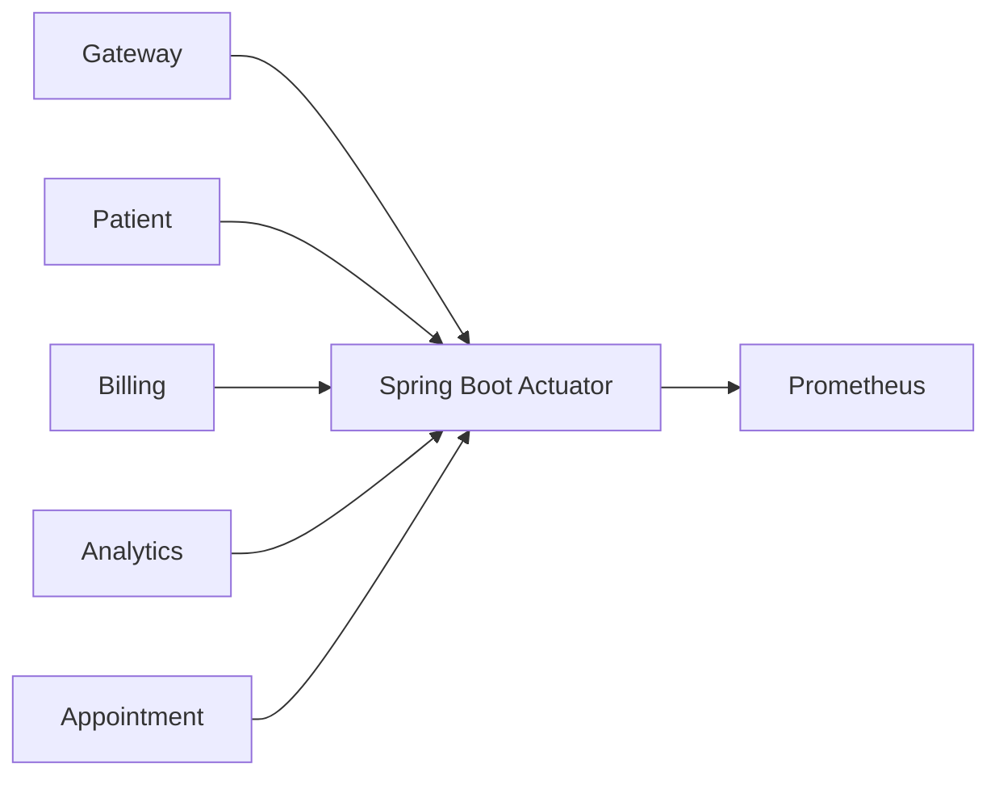

---

## Metrics Collected

- HTTP Request Count
- Response Time
- JVM Heap Usage
- CPU Utilization
- Active Threads
- Kafka Metrics
- Database Connection Pool
- Memory Usage

Prometheus stores these metrics in a time-series database for querying and visualization.

---

# 📉 Grafana

Grafana connects to Prometheus and provides real-time dashboards for system monitoring.

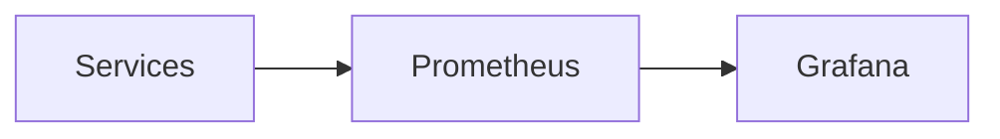

Typical dashboards include:

- JVM Memory
- CPU Usage
- HTTP Request Rate
- Response Time
- Kafka Throughput
- Error Rate
- Active Sessions

---

# 🐳 Dockerized Architecture

Each microservice executes inside its own Docker container.

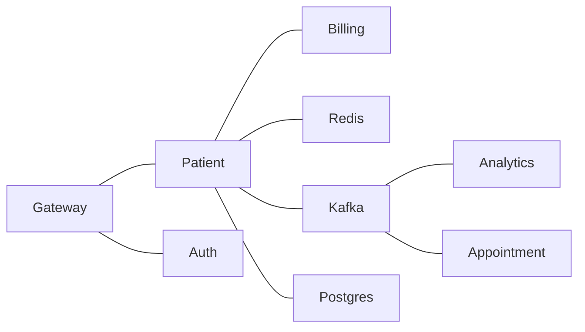

Benefits:

- Environment Consistency
- Easy Deployment
- Service Isolation
- Independent Scaling

---

# 🧪 Integration Testing

The project includes integration tests using:

- JUnit
- Rest Assured

The tests validate complete request flows through the API Gateway.

Typical scenarios include:

- User Login
- JWT Authentication
- Protected APIs
- Patient CRUD Operations
- Invalid Token Handling
- HTTP Status Validation

---

# 📊 Observability Stack

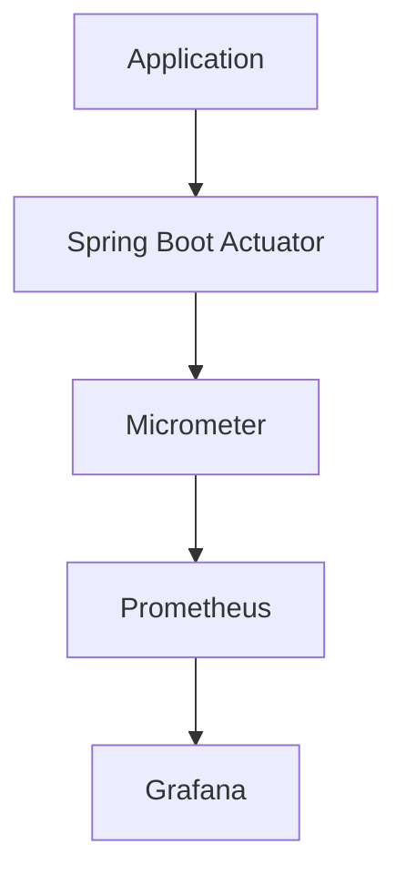

This monitoring pipeline provides visibility into application health and runtime performance.

---

# 🏆 Production Engineering Practices

This project demonstrates several backend engineering concepts commonly found in production systems.

| Feature | Technology |
|----------|------------|
| Authentication | JWT |
| API Gateway | Spring Cloud Gateway |
| Service Communication | gRPC |
| Event Streaming | Apache Kafka |
| Database | PostgreSQL |
| Caching | Redis |
| Fault Tolerance | Resilience4j |
| Monitoring | Prometheus |
| Visualization | Grafana |
| Metrics | Spring Boot Actuator + Micrometer |
| Containerization | Docker |
| Testing | JUnit + Rest Assured |

---

# 💡 Design Principles

The system was designed around the following principles:

- Separation of Concerns
- Loose Coupling
- High Cohesion
- Independent Deployability
- Fault Isolation
- Event-Driven Communication
- Scalability
- Observability
- Resilience

# ⚙️ Production-Ready Features

Beyond implementing business functionality, this project incorporates several production-grade backend engineering practices focused on **performance**, **fault tolerance**, **observability**, and **system reliability**.

---

# ⚡ Redis Caching

The Patient Service uses **Redis** as an in-memory cache to reduce database access for frequently requested patient information.

## Cache Workflow


## Cache Strategy

1. Client requests patient details.
2. Patient Service first checks Redis.
3. If data exists (**Cache Hit**), it is returned immediately.
4. Otherwise (**Cache Miss**), data is fetched from PostgreSQL.
5. The result is stored in Redis for future requests.

### Benefits

- Reduced Database Load
- Lower Latency
- Faster Response Times
- Improved Scalability

---

# 🛡 Circuit Breaker (Resilience4j)

The Patient Service communicates synchronously with the Billing Service using gRPC.

If Billing becomes unavailable, repeated requests could overwhelm the Patient Service.

To prevent cascading failures, the project uses **Resilience4j Circuit Breakers**.

---

## Circuit Breaker States


---

## Closed State

All requests are forwarded normally.

```text
Patient Service

↓

Billing Service

↓

Success
```

---

## Open State

After multiple consecutive failures:

```text
Patient Service

↓

Circuit Breaker

↓

Billing Service (Skipped)

↓

Immediate Failure Response
```

No requests reach the Billing Service.

---

## Half Open State

After the configured wait duration:

- A limited number of requests are allowed.
- If successful, the circuit closes.
- Otherwise, it reopens.

---

## Advantages

- Prevents Cascading Failures
- Faster Failure Detection
- Improved Availability
- Automatic Recovery

---

# 🚦 API Rate Limiting

The API Gateway implements **Rate Limiting** to protect backend services against excessive traffic.


### Benefits

- Prevents API Abuse
- Protects Backend Services
- Improves Stability
- Supports Fair Resource Usage

---

# 📈 Spring Boot Actuator

Spring Boot Actuator exposes operational endpoints that provide runtime information about the application.

Available endpoints include:

```text
/actuator/health

/actuator/info

/actuator/metrics

/actuator/prometheus
```

These endpoints are used for monitoring and health checks.

---

# 📊 Micrometer

Micrometer serves as the metrics abstraction layer for Spring Boot.

It collects application metrics and exports them in a format compatible with Prometheus.

```text
Spring Boot

↓

Micrometer

↓

Prometheus
```

---

# 📈 Prometheus

Prometheus continuously collects metrics from each microservice by scraping the `/actuator/prometheus` endpoint.

## Monitoring Architecture

```mermaid
flowchart LR

Gateway

Patient

Billing

Analytics

Appointment

Actuator["Spring Boot Actuator"]

Prometheus

Gateway --> Actuator

Patient --> Actuator

Billing --> Actuator

Analytics --> Actuator

Appointment --> Actuator

Actuator --> Prometheus
```

---

## Metrics Collected

- HTTP Request Count
- Response Time
- JVM Heap Usage
- CPU Utilization
- Active Threads
- Kafka Metrics
- Database Connection Pool
- Memory Usage

Prometheus stores these metrics in a time-series database for querying and visualization.

---

# 📉 Grafana

Grafana connects to Prometheus and provides real-time dashboards for system monitoring.

```mermaid
flowchart LR

Services

Prometheus

Grafana

Services --> Prometheus

Prometheus --> Grafana
```

Typical dashboards include:

- JVM Memory
- CPU Usage
- HTTP Request Rate
- Response Time
- Kafka Throughput
- Error Rate
- Active Sessions

---

# 🐳 Dockerized Architecture

Each microservice executes inside its own Docker container.

```mermaid
flowchart LR

Gateway

Patient

Billing

Analytics

Appointment

Auth

Redis

Kafka

Postgres

Gateway --- Patient

Gateway --- Auth

Patient --- Billing

Patient --- Kafka

Kafka --- Analytics

Kafka --- Appointment

Patient --- Redis

Patient --- Postgres
```

Benefits:

- Environment Consistency
- Easy Deployment
- Service Isolation
- Independent Scaling

---

# 🧪 Integration Testing

The project includes integration tests using:

- JUnit
- Rest Assured

The tests validate complete request flows through the API Gateway.

Typical scenarios include:

- User Login
- JWT Authentication
- Protected APIs
- Patient CRUD Operations
- Invalid Token Handling
- HTTP Status Validation

---

# 📊 Observability Stack

```mermaid
flowchart TD

Application

SpringActuator["Spring Boot Actuator"]

Micrometer

Prometheus

Grafana

Application --> SpringActuator

SpringActuator --> Micrometer

Micrometer --> Prometheus

Prometheus --> Grafana
```

This monitoring pipeline provides visibility into application health and runtime performance.

---

# 🏆 Production Engineering Practices

This project demonstrates several backend engineering concepts commonly found in production systems.

| Feature | Technology |
|----------|------------|
| Authentication | JWT |
| API Gateway | Spring Cloud Gateway |
| Service Communication | gRPC |
| Event Streaming | Apache Kafka |
| Database | PostgreSQL |
| Caching | Redis |
| Fault Tolerance | Resilience4j |
| Monitoring | Prometheus |
| Visualization | Grafana |
| Metrics | Spring Boot Actuator + Micrometer |
| Containerization | Docker |
| Testing | JUnit + Rest Assured |

---

# 💡 Design Principles

The system was designed around the following principles:

- Separation of Concerns
- Loose Coupling
- High Cohesion
- Independent Deployability
- Fault Isolation
- Event-Driven Communication
- Scalability
- Observability
- Resilience
