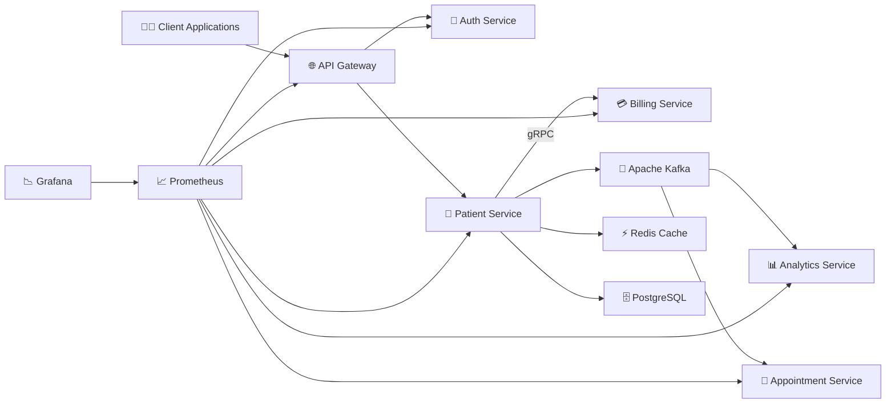

# 🏥 Patient Management System

> A **production-style Java Spring Boot Microservices** application demonstrating modern backend engineering practices including **REST APIs, gRPC, Apache Kafka, JWT Authentication, Spring Cloud Gateway, Redis Caching, Resilience4j Circuit Breakers, Prometheus, Grafana, Docker**, and **Integration Testing**.

<p align="center">


</p>

---

# 📖 Overview

Patient Management System is a **distributed microservices application** built with **Java 21** and **Spring Boot** to demonstrate real-world backend architecture.

Unlike a traditional monolithic application, the system is divided into multiple independent services that communicate using the most appropriate communication pattern:

- 🌐 REST APIs for client communication
- ⚡ gRPC for fast synchronous service-to-service communication
- 📨 Apache Kafka for asynchronous event-driven communication

The project also incorporates production-grade backend concepts including:

- 🔐 JWT Authentication & Authorization
- 🌐 Spring Cloud Gateway
- 💾 Redis Caching
- ⚡ Circuit Breakers (Resilience4j)
- 📊 Prometheus Monitoring
- 📈 Grafana Dashboards
- 🐳 Docker Containerization
- 🧪 Integration Testing

---

# ✨ Features

### 👨‍⚕️ Patient Management

- Create Patient
- Update Patient
- Delete Patient
- Get Patient Details
- Validation & Exception Handling

### 🔐 Authentication

- JWT Login
- Token Validation
- Protected APIs
- Spring Security

### 🌐 API Gateway

- Centralized Routing
- JWT Validation
- Rate Limiting
- Single Entry Point

### 💳 Billing

- gRPC Communication
- Billing Account Creation

### 📨 Event Driven Architecture

- Apache Kafka
- Patient Created Events
- Analytics Processing
- Appointment Synchronization

### ⚡ Performance

- Redis Caching
- Spring Data JPA
- PostgreSQL

### 📊 Monitoring

- Prometheus
- Grafana
- Spring Boot Actuator
- Micrometer

### 🛡 Fault Tolerance

- Resilience4j Circuit Breakers

---

# 🛠 Tech Stack

| Category | Technologies |
|-----------|-------------|
| **Language** | Java 21 |
| **Framework** | Spring Boot 3 |
| **Security** | Spring Security, JWT |
| **Gateway** | Spring Cloud Gateway |
| **Communication** | REST, gRPC |
| **Messaging** | Apache Kafka |
| **Serialization** | Protocol Buffers |
| **Database** | PostgreSQL |
| **Cache** | Redis |
| **ORM** | Spring Data JPA |
| **Monitoring** | Prometheus, Grafana |
| **Observability** | Spring Boot Actuator, Micrometer |
| **Fault Tolerance** | Resilience4j |
| **Testing** | JUnit, Rest Assured |
| **Build Tool** | Maven |
| **Containerization** | Docker |

---

# 🏗️ Technical Architecture



---

# 🎯 System Architecture

The application follows a **Microservices Architecture**, where each service owns its business logic and database while communicating through synchronous and asynchronous channels.

| Service | Responsibility |
|----------|---------------|
| 🌐 API Gateway | Routing, Authentication, Rate Limiting |
| 🔐 Auth Service | JWT Authentication & Validation |
| 🏥 Patient Service | Patient CRUD Operations |
| 💳 Billing Service | Billing Account Creation (gRPC) |
| 📊 Analytics Service | Kafka Consumer for Analytics |
| 📅 Appointment Service | Appointment Management |

---

# 🚀 Communication Pattern

| Communication | Technology | Purpose |
|---------------|------------|----------|
| Client → Gateway | REST | External APIs |
| Gateway → Auth | REST | JWT Validation |
| Gateway → Patient | REST | CRUD Operations |
| Patient → Billing | gRPC | Billing Account Creation |
| Patient → Kafka | Kafka | Publish Patient Events |
| Kafka → Analytics | Kafka Consumer | Analytics Processing |
| Kafka → Appointment | Kafka Consumer | Patient Synchronization |

---

# 📂 Project Modules

```text
patient-management/

├── api-gateway
├── auth-service
├── patient-service
├── billing-service
├── analytics-service
├── appointment-service
├── grpc-proto
├── docker-compose.yml
└── README.md
```
# 🧩 Microservices Overview

The application follows the **Database per Service** pattern, where each microservice owns its own business logic and persistence layer. This enables independent development, deployment, and scaling while reducing coupling between services.

---

## 🌐 API Gateway

The API Gateway acts as the **single entry point** for all client requests.

### Responsibilities

- Routes incoming requests to appropriate microservices
- Validates JWT tokens through the Auth Service
- Applies Rate Limiting
- Hides internal microservice URLs from clients
- Provides centralized request handling

### Why API Gateway?

Without an API Gateway:

```text
Client
 ├── Patient Service
 ├── Billing Service
 ├── Auth Service
 ├── Appointment Service
 └── Analytics Service
```

The client must know every service URL.

With an API Gateway:

```text
Client
      │
      ▼
API Gateway
      │
 ┌────┴────┐
 ▼         ▼
Auth    Patient
```

The client communicates with only one endpoint while the Gateway handles routing internally.

---

## 🔐 Auth Service

The Auth Service is responsible for authentication and authorization.

### Responsibilities

- User Login
- Password Verification
- JWT Generation
- JWT Validation
- User Management

### Database

- PostgreSQL

### Main Components

```text
Controller
     │
     ▼
Service
     │
     ▼
Repository
     │
     ▼
PostgreSQL
```

### Authentication Flow

```text
User Login

↓

Verify Credentials

↓

Generate JWT

↓

Return Token
```

The Gateway later validates every protected request using this service.

---

## 🏥 Patient Service

The Patient Service is the **core business service** of the application.

It manages patient records and coordinates communication with other services.

### Responsibilities

- Create Patient
- Read Patient
- Update Patient
- Delete Patient
- Validate Input
- Publish Kafka Events
- Call Billing Service via gRPC
- Redis Caching

### Architecture

```text
Controller
     │
     ▼
Service
     │
     ▼
Repository
     │
     ▼
PostgreSQL
```

### Internal Workflow

1. Validate Request DTO
2. Check if Email Already Exists
3. Save Patient
4. Call Billing Service (gRPC)
5. Publish Kafka Event
6. Return Response

---

## 💳 Billing Service

The Billing Service is responsible for managing billing accounts.

Instead of exposing REST APIs, it exposes a **gRPC API** for high-performance internal communication.

### Responsibilities

- Create Billing Account
- Respond to gRPC Requests

### Communication

```text
Patient Service

↓

gRPC

↓

Billing Service

↓

Billing Account Created
```

Using gRPC instead of REST reduces serialization overhead and improves performance for internal service communication.

---

## 📊 Analytics Service

The Analytics Service consumes events published to Kafka.

It is completely independent of the Patient Service.

### Responsibilities

- Consume Patient Events
- Process Analytics
- Logging
- Event Processing

### Event Flow

```text
Patient Created

↓

Kafka Topic

↓

Analytics Service

↓

Process Event
```

The Patient Service does not know whether Analytics exists, making the architecture loosely coupled.

---

## 📅 Appointment Service

The Appointment Service manages appointment-related operations.

It also listens to Kafka events to keep patient information synchronized locally.

### Responsibilities

- Appointment Scheduling
- Kafka Consumer
- Patient Cache Synchronization

### Why Consume Kafka Events?

Instead of calling the Patient Service every time appointment data is required, the Appointment Service maintains its own lightweight copy of patient information.

Benefits:

- Reduced Network Calls
- Faster Reads
- Independent Availability
- Better Scalability

---

# 🗄 Database Per Service Pattern

Each microservice owns its own database.

```text
Patient Service
       │
       ▼
Patient Database

Billing Service
       │
       ▼
Billing Database

Auth Service
       │
       ▼
User Database
```

### Why?

Sharing databases tightly couples services.

If Billing directly accesses the Patient database:

- Schema changes become risky
- Independent deployment becomes difficult
- Services become dependent on each other

Owning individual databases keeps each service autonomous.

---

# 🔄 Communication Between Services

The application uses different communication mechanisms depending on the use case.

| Communication | Technology | Why? |
|---------------|------------|------|
| Client → Gateway | REST | Public APIs |
| Gateway → Auth | REST | Token Validation |
| Gateway → Patient | REST | CRUD Operations |
| Patient → Billing | gRPC | Fast synchronous communication |
| Patient → Kafka | Kafka | Event Publishing |
| Kafka → Analytics | Kafka Consumer | Analytics Processing |
| Kafka → Appointment | Kafka Consumer | Patient Synchronization |

---

# 🧠 Why Multiple Communication Patterns?

The project intentionally combines **REST**, **gRPC**, and **Kafka**, as each solves a different problem.

### REST

Used for communication with external clients.

**Advantages**

- Human-readable
- Easy to debug
- Widely supported

---

### gRPC

Used for synchronous communication between internal services.

**Advantages**

- Binary serialization (Protocol Buffers)
- Smaller payloads
- Faster than REST
- Strongly typed
- Automatic client/server code generation

---

### Kafka

Used for asynchronous event-driven communication.

**Advantages**

- Loose coupling
- High throughput
- Event replay
- Independent consumers
- Horizontal scalability

Instead of directly notifying every service, the Patient Service publishes a single event, allowing multiple services to react independently.

---

# 📌 Why Microservices?

Compared to a monolithic architecture, this design provides:

- Independent deployment
- Independent scaling
- Better fault isolation
- Technology flexibility
- Clear ownership of business domains
- Easier maintenance
- Improved scalability

Each microservice focuses on a single business capability while collaborating with others through well-defined interfaces.

---
